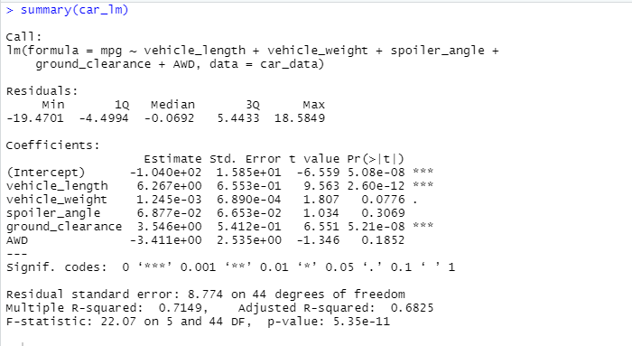
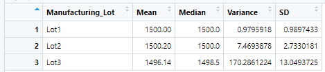
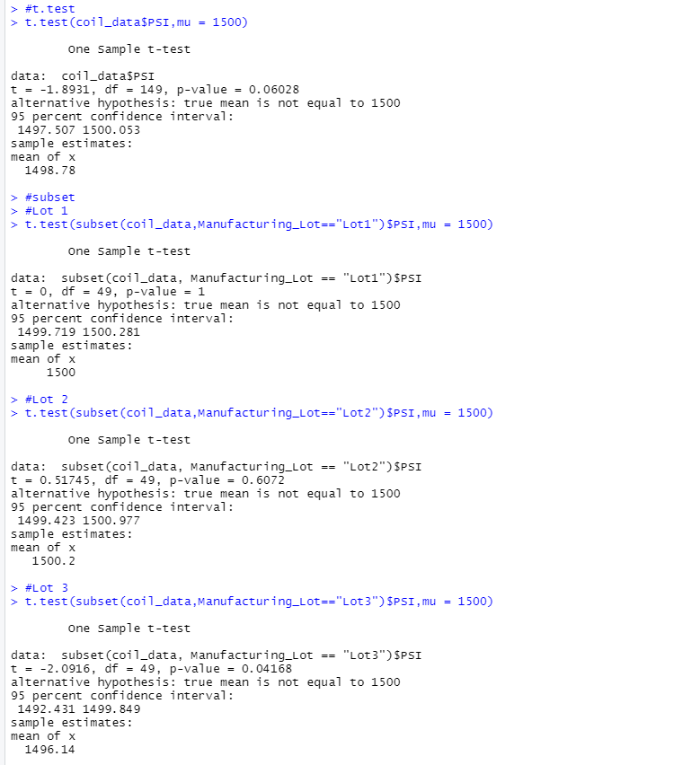

# **MechaCar Statistical Analysis**

## **Linear Regression to Predict MPG**

Statistical Summary of the Linear Regression Model:

1. Which variables/coefficients provided a non-random amount of variance to the mpg values in the dataset?

- Vehicle length, ground clearance, and the intercept provided the most non-random amount of variance to the mpg values in the dataset. 

2. Is the slope of the linear model considered to be zero? Why or why not?

- The slope of the linear model is not considered zero as the p-value is smaller than 0.05.

3. Does this linear model predict mpg of MechaCar prototypes effectively? Why or why not?

- The r-squared value is 0.7149, which means that 71% of the time it will correctly predicts the mpg of MechaCar prototypes. 
- There are other variables and factors that contribute to the variation in mpg that have not been included in this linear regression model. 

## **Summary Statistics on Suspension Coils**

The design specifications for the MechaCar suspension coils dictate that the variance of the suspension coils must not exceed 100 pounds per square inch. 

1. Does the current manufacturing data meet this design specification for all manufacturing lots in total and each lot individually? Why or why not?

- In total the manufacturing data meets the design specification for all manufacturing lots as the variance is at 62.29 pounds per square inch.
- Lot 1 and Lot 2 are both within the variance of the suspension coils.
- Lot 3 has a variance that exceeds 100 pounds per square inch at 170.29 and does not meet the design specifications. 

## **T-Tests on Suspension Coils**

- Lot 1 has a p-value of 1 and doesnt have a statistical difference from the population mean.
- Lot 2 has a p-value of .6 and doesnt have a statistical difference from the population mean.
- Lot 3 has a p-value of 0.04168 and does have a statistically difference from the population mean.

## **Study Design: MechaCar vs Competition**

Consumers are intrested in safety ratings, fuel efficiency, and cost of the vehicle. We could use these metrics to evaluate how the MechaCar performs against the competition. It is important to make sure that the MechaCar performs better than other vehicles on the market, we would compare MechaCar data against the closest market competition to evaluate its position with the consumers. The null hypothesis would be that there is no statistical difference between MechaCar prototypes and its competition.  We would use a t-test because we need to determine whether or not there is a statistical difference between the mean of data points from MechaCar prototypes and the mean from its competition. The data needed for this study would be all the safety ratings, fuel efficiency and the cost of the vehicles produced by each competing manufacturer. When all data is present we would run the t-test to either reject the null hypothesis or show that there is statistical diffence between MechaCar prototypes and its competition.